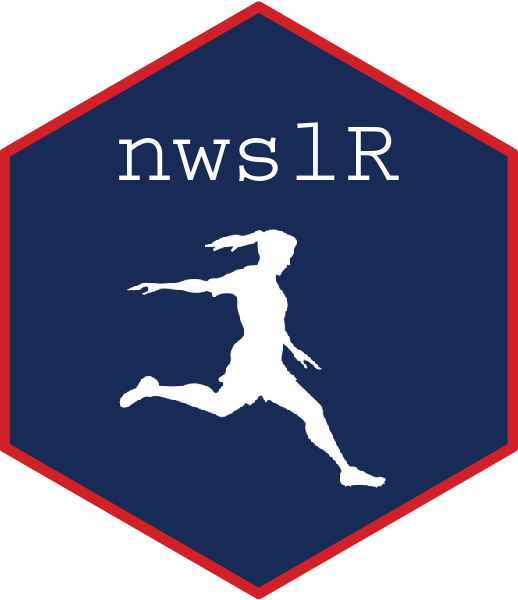

# About nwslR

# nwslR 

`nwslR` is an R ecosystem that contains datasets and analysis functionality for the National Women’s Soccer League (NWSL). Founded in 2013, the NWSL is the United States’ top professional women’s soccer league, featuring players from all over the world. In an effort to create a reproducible and friendly ecosystem, the setup is heavily inspired by the [nflverse](https://github.com/nflverse). Many thanks to [Tan Ho](https://github.com/tanho63) for all his help and advice. An earlier version of this project, created in collaboration with [Sophia Tannir](https://github.com/sophiatannir), exists [here](https://github.com/adror1/nwslR). It is no longer maintained. 

Accessibility of data in women's sports (and particularly soccer) lags behind its male counterparts. This project is a contribution to a growing ecosystem of open data sources that aims to make data available to fans and analysts of the league. There are currently two repositories available for public use: 

- [nwsldata](https://github.com/nwslR/nwsldata) is a repo to hold scraped data in csv format. The data is updated several times a week during the season and more sporadically in the offseason. You can directly download csvs from [here](https://github.com/nwslR/nwsldata/releases). 
- [nwslR](https://github.com/nwslR/nwslR), provides functions to easily access data that is loaded in the `nwsldata` repo. 

These two repositories allow R users and users of other languages and software to use this data. 

If you see anything you'd like added, changed, or updated, please open up a new issue of your own. If you are interested in contributing, please contact us directly. If you use this data in any work, please cite us. 

# Contact
- Arielle Dror [email](mailto:arielle.dror@gmail.com)|[twitter](https://www.twitter.com/arielle_dror)
